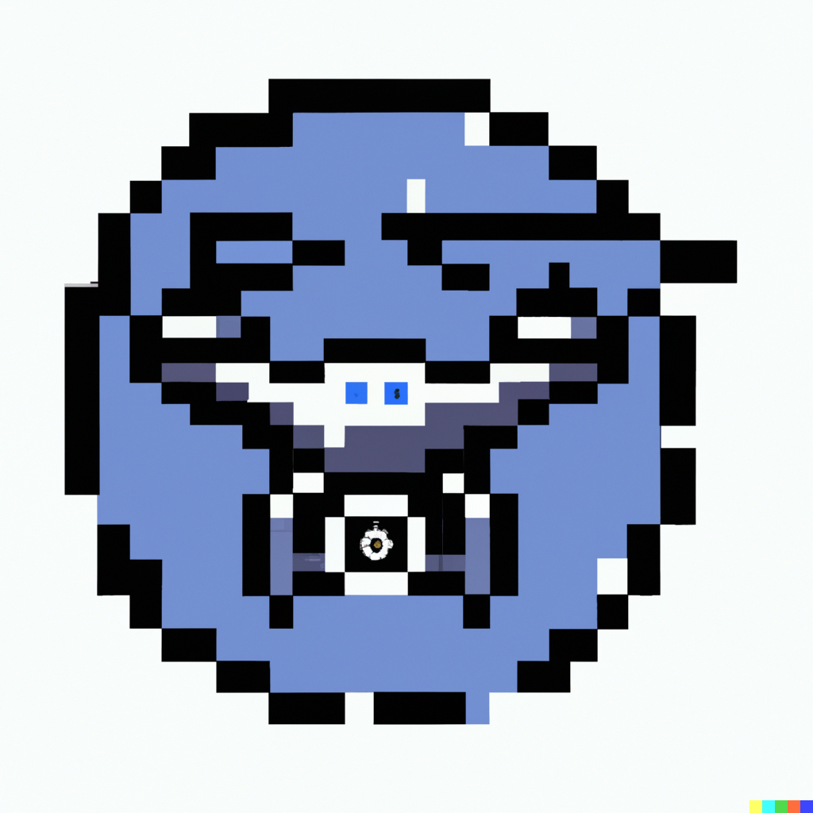

<!-- PROJECT SHIELDS -->
<!--
*** I'm using markdown "reference style" links for readability.
*** Reference links are enclosed in brackets [ ] instead of parentheses ( ).
*** See the bottom of this document for the declaration of the reference variables
*** for contributors-url, forks-url, etc. This is an optional, concise syntax you may use.
*** https://www.markdownguide.org/basic-syntax/#reference-style-links
-->

<!-- PROJECT LOGO -->
 

  
 
<i>
This unnecesary logo was automatically generated using DALL-E AI.
</i>

<h3 align="center">Tello controller</h3>
 

    ROS controller for the drone DJI Tello using C++.
     
    <a href="https://github.com/rguitar96/tello-controller/issues">Report Bug</a>
    ·
    <a href="https://github.com/rguitar96/tello-controller/issues">Request Feature</a>
  

<!-- USAGE EXAMPLES -->
## Usage

Move the project to your catkin workspace and run:
~~~~
>> catkin build
~~~~

in order to build the project.

After this, you will need to run ROS core and the nodes you want to launch.

<!-- LICENSE -->
## License

Distributed under the MIT License. See `LICENSE.txt` for more information.

<!-- CONTACT -->
## Contact

Rodrigo Pueblas - [@rguitar96](https://twitter.com/rguitar96) - rodrigo.pueblas@hotmail.com

Project Link: [https://github.com/rguitar96/business-scout](https://github.com/rguitar96/business-scout)

